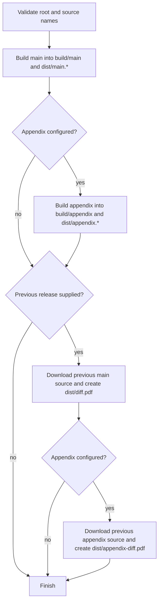

# LaTeX Release

The current LaTeX toolchain builds each document in an isolated sandbox,
optionally formats the bibliography with `ures-bib`, expands the source, and
creates diffs against source assets attached to earlier GitHub releases.

## Recommended CI entry

Use the [`publish-latex` action](actions-release.md#publish-latex) directly or
enable `latex-project` in the
[comprehensive release workflow](workflows-release.md#comprehensive-release-gateway).
Both ultimately run the consuming repository's semantic-release configuration.
The action checks this repository out as `.devops`, so the prepare command can
call its scripts without copying them into the consumer.

## Consumer configuration

A consumer with `paper.tex` and a complete `supplement.tex` can use:

```js
module.exports = {
  branches: ["trunk"],
  plugins: [
    "@semantic-release/commit-analyzer",
    "@semantic-release/release-notes-generator",
    [
      "@semantic-release/exec",
      {
        prepareCmd:
          "bash .devops/scripts/latex/prepare-release.sh --root . --last ${lastRelease.version} --main paper --appendix supplement",
      },
    ],
    [
      "@semantic-release/github",
      {
        assets: [
          {
            path: "dist/main.pdf",
            name: "document-${nextRelease.version}.pdf",
          },
          {
            path: "dist/main_expanded.tex",
            name: "source-${nextRelease.version}.tex",
          },
          {
            path: "dist/main.bbl",
            name: "bibliography-${nextRelease.version}.bbl",
            optional: true,
          },
          {
            path: "dist/main.bib",
            name: "bibliography-${nextRelease.version}.bib",
            optional: true,
          },
          {
            path: "dist/diff.pdf",
            name: "diff-${lastRelease.version}-to-${nextRelease.version}.pdf",
            optional: true,
          },
          {
            path: "dist/appendix.pdf",
            name: "appendix-${nextRelease.version}.pdf",
            optional: true,
          },
          {
            path: "dist/appendix_expanded.tex",
            name: "appendix-source-${nextRelease.version}.tex",
            optional: true,
          },
          {
            path: "dist/appendix.bbl",
            name: "appendix-bibliography-${nextRelease.version}.bbl",
            optional: true,
          },
          {
            path: "dist/appendix.bib",
            name: "appendix-bibliography-${nextRelease.version}.bib",
            optional: true,
          },
          {
            path: "dist/appendix-diff.pdf",
            name: "appendix-diff-${lastRelease.version}-to-${nextRelease.version}.pdf",
            optional: true,
          },
        ],
      },
    ],
  ],
};
```

Omit `--appendix supplement` and the appendix assets when the repository has no
standalone appendix document. The appendix source must be a complete LaTeX root
document; an `\input` fragment cannot be compiled as the second root.

The previous main source must be attached as
`source-<version>.tex`. Appendix comparison looks for
`appendix-source-<version>.tex`; if an older release predates the appendix, that
asset may be absent and the appendix diff is skipped with a warning.

## Prepare flow

`prepare-release.sh` performs this order:



Each `build.sh` call performs an initial LaTeX build, detects bibliographies from
the generated `.aux` unless `--bib` is supplied, formats the cited entries when
`ures-bib` is available, and recompiles. Main and appendix use separate sandbox
and artifact names, so one document's bibliography does not overwrite the
other's.

## Script reference

### `prepare-release.sh`

```bash
bash .devops/scripts/latex/prepare-release.sh \
  --root . \
  --last 1.3.0 \
  --main paper \
  --appendix supplement
```

| Flag | Required/default | Meaning |
|---|---|---|
| `--root DIR` | Required | Consumer project root |
| `--last VERSION` | Optional | Previous release; omit or pass `null` to skip diffs |
| `--main NAME` | `main` | Main source stem |
| `--appendix NAME` | Empty | Complete appendix source stem; explicit missing files fail |

GitHub Actions provides `GITHUB_REPOSITORY_OWNER` and `GITHUB_REPOSITORY`. Export
them manually when using `--last` outside Actions.

### `build.sh`

```bash
bash .devops/scripts/latex/build.sh \
  --root . \
  --filename paper \
  --output-name main \
  --bib refs
```

It publishes `dist/<output>.pdf`, `dist/<output>.bbl`, and
`dist/<output>_expanded.tex`. It also publishes `dist/<output>.bib` when
`ures-bib` formats at least one bibliography. Without a `.bbl`, the script
creates an empty `.bbl` placeholder and expands the source without one.

### `compare.sh`

Compares an already built current document with one published source asset:

```bash
GITHUB_TOKEN=... bash .devops/scripts/latex/compare.sh \
  --root . \
  --from main \
  --compare v1.3.0 \
  --owner stone-home \
  --repo Example-Paper \
  --output diff
```

Run `build.sh --output-name main` first. The default downloaded asset is
`source-1.3.0.tex`. Use `--asset-name appendix-source` for an appendix. When the
release does not carry the asset, the diff is skipped with a warning.

### `diff-releases.sh`

Downloads and compares two published releases without reading the working-tree
source:

```bash
GITHUB_TOKEN=... bash .devops/scripts/latex/diff-releases.sh \
  --root . \
  --owner stone-home \
  --repo Example-Paper \
  --old v1.2.0 \
  --new v1.3.0
```

Add `--asset-name appendix-source --output appendix-diff-v1.2.0-to-v1.3.0` for
published appendices.

### `download-release-file.sh`

Downloads one exact release asset through the GitHub Releases API:

```bash
GITHUB_TOKEN=... bash .devops/scripts/latex/download-release-file.sh \
  --owner stone-home \
  --repo Example-Paper \
  --version v1.3.0 \
  --asset source-1.3.0.tex \
  --output /tmp/release-source
```

Private repositories require a token that can read their releases. The script
also requires `jq` and `curl`.

### `validate.sh`

Checks that the selected root document exists:

```bash
bash .devops/scripts/latex/validate.sh --root . --filename paper
```

## Build directories and dependencies

- `build/<task>/` contains isolated compiler sandboxes.
- `build/logs/` collects useful LaTeX and BibTeX logs.
- `dist/` contains only release artifacts.
- Required build tools are `pdflatex` and `bibtex`.
- `latexpand` creates the single-file source; without it, the root source is
  copied as the expanded artifact.
- `latexdiff` is required for comparisons.
- `ures-bib` is optional and enables cited-entry bibliography formatting.
- Release downloads require `curl`, `jq`, and normally `GITHUB_TOKEN`.

`scripts/latex/install_dep.sh` is an interactive workstation bootstrap that can
install a full TeX distribution, initialize Conda, and activate a named Conda
environment. Review it before running it. `init-semantic-latex.sh` generates an
older standalone scaffold and does not represent the current `.devops` flow;
new consumers should use the configuration above.

## Verification

Run the fixture-backed suite from this repository:

```bash
bash test/run-tests.sh
```

It never calls the live GitHub API. Tests use temporary project copies and a
local curl stub. Missing TeX tools are reported as skips rather than passes.
